# generative-art

Random generative stuff made with [Processing](https://processing.org/).

[//]: BLOB
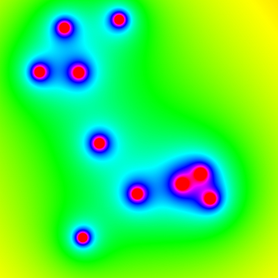

[//]: BRUSH-1
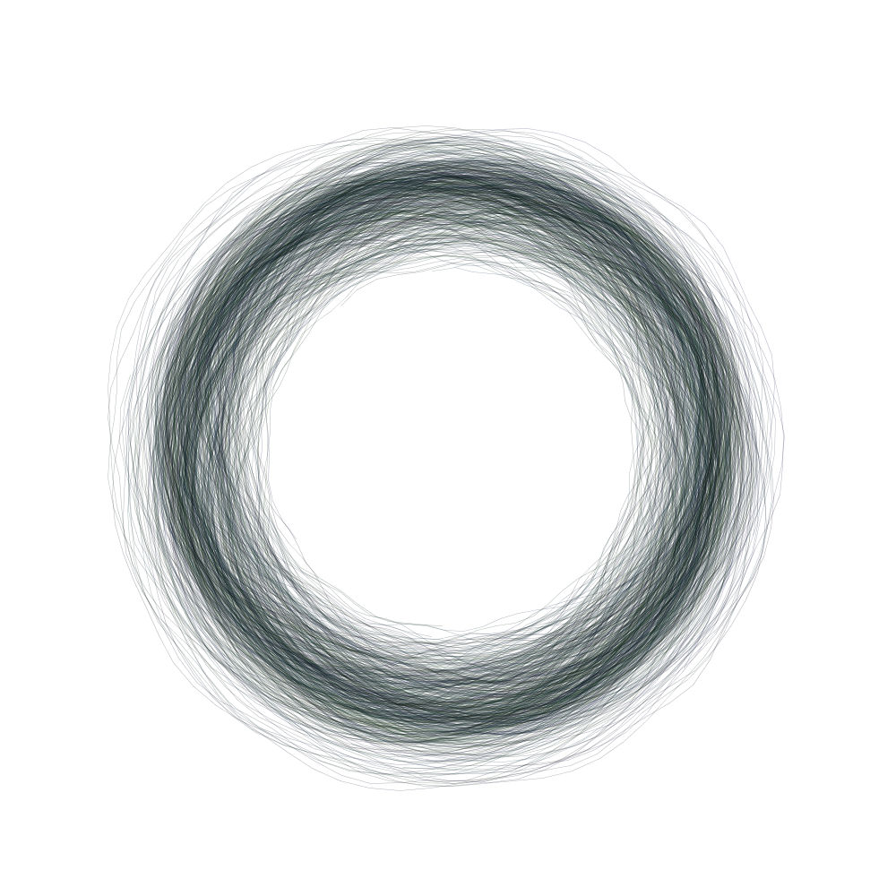

[//]: CLOCK

[//]: CLOUDS

[//]: CYLINDER
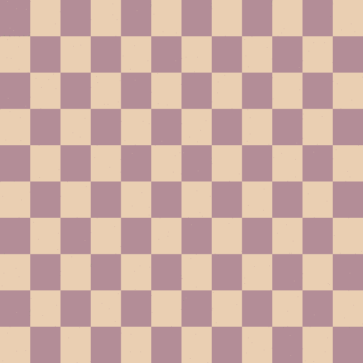

[//]: MATCHES
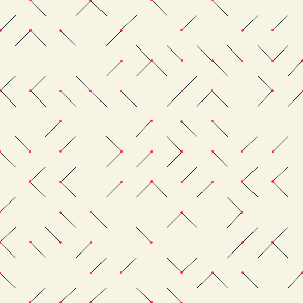

[//]: FOURIER

[//]: PENDULUM
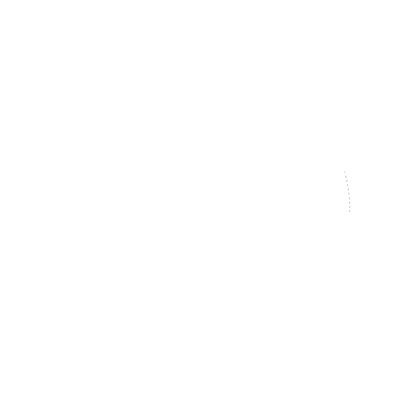

[//]: BRUSHES-2
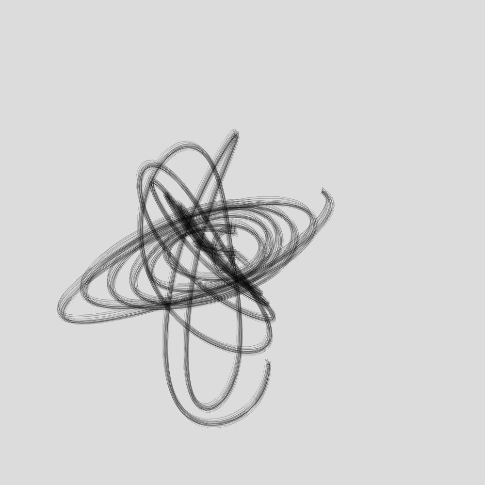
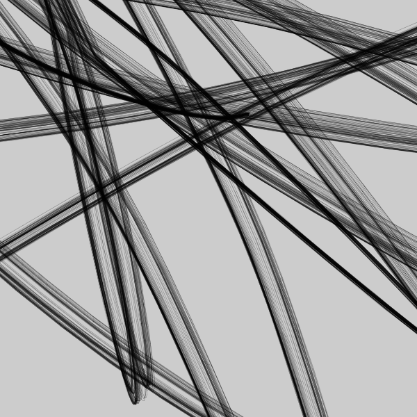
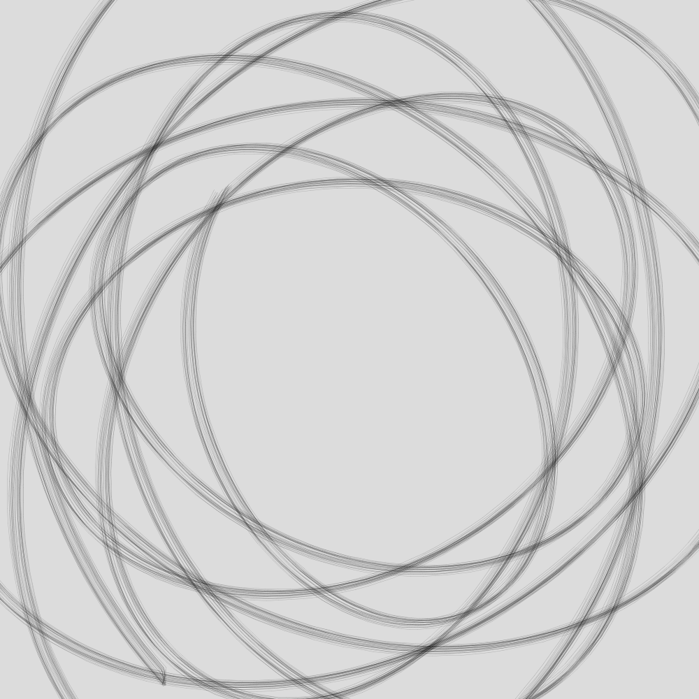
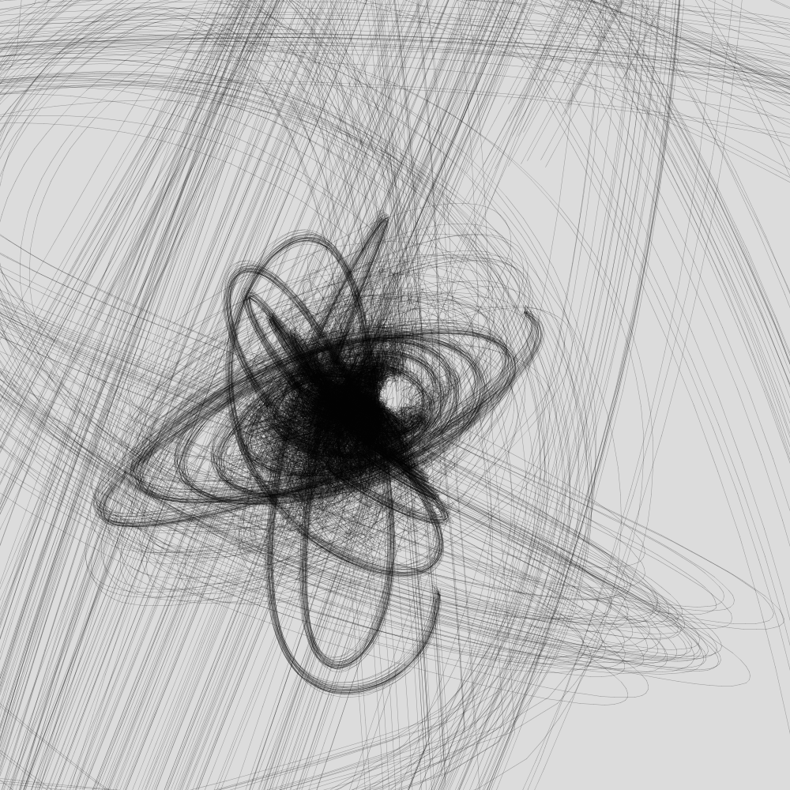
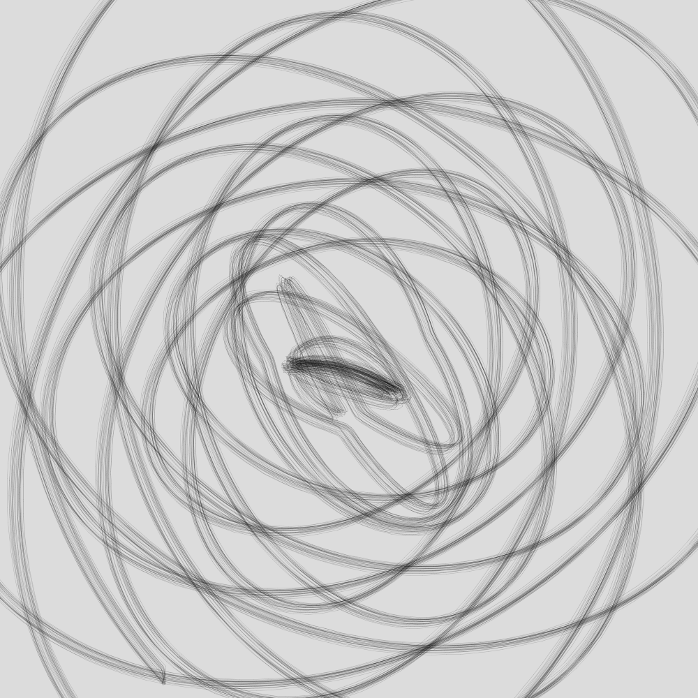

[//]: NEIGHBORS

[//]: TILES

[//]: SEMICIRCLE

[//]: NOISE 
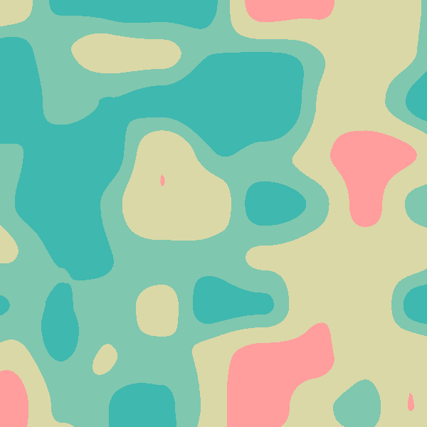

[//]: NOISE-MIRROR

[//]: CIRCLE-TRIANGLE

[//]: GAUSSIAN-PROCESS

