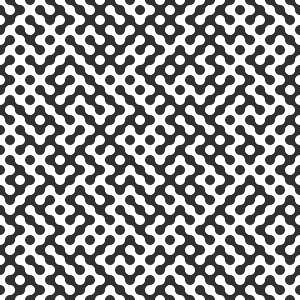

# generative-art

Random generative stuff made with [Processing](https://processing.org/).

[//]: BLOB

[//]: BRUSH-1

[//]: CLOCK

[//]: CLOUDS

[//]: CYLINDER

[//]: MATCHES

[//]: FOURIER

[//]: PENDULUM

[//]: BRUSHES-2

[//]: NEIGHBORS

[//]: TILES

[//]: SEMICIRCLE

[//]: NOISE 

[//]: NOISE-MIRROR

[//]: CIRCLE-TRIANGLE

[//]: GAUSSIAN-PROCESS

